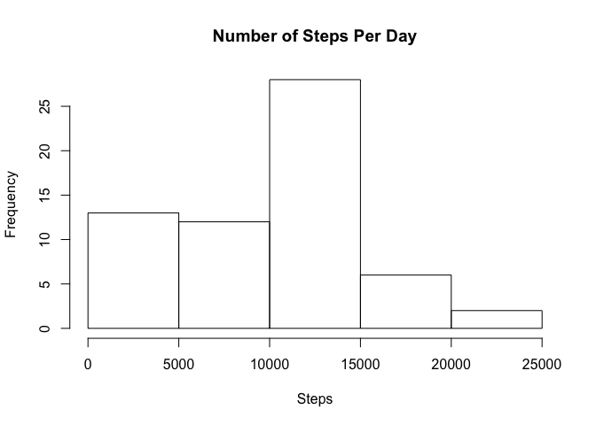
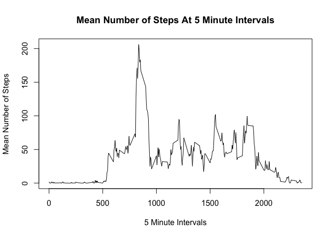
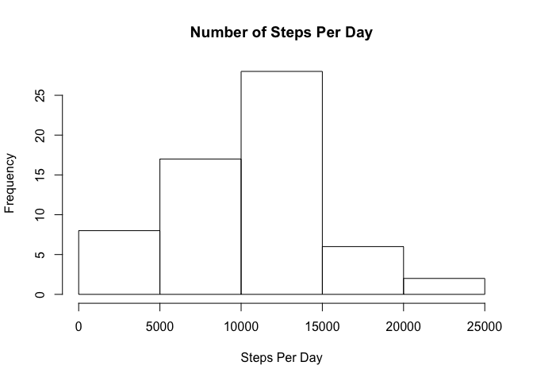
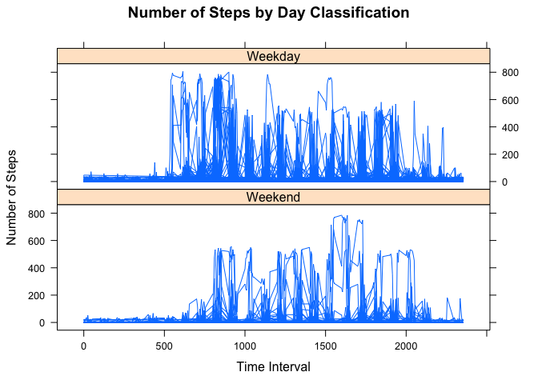

# Reproducible Data Project 1
Tyler Peterson  
10/6/2016  


```r
  setwd("/Users/i64425/GitHub/coursera_5_reproducible_research/Project1")
  library(dplyr, quietly = TRUE)
  library(lattice, quietly = TRUE)
```


## Loading and preprocessing the data


```r
  # Read data from .csv and load libraries

  df <- read.csv("activity.csv")

# Explore data
  #numDates = df %>% distinct(date)
  #numDates$date
  str(df)
```

```
## 'data.frame':	17568 obs. of  3 variables:
##  $ steps   : int  NA NA NA NA NA NA NA NA NA NA ...
##  $ date    : Factor w/ 61 levels "2012-10-01","2012-10-02",..: 1 1 1 1 1 1 1 1 1 1 ...
##  $ interval: int  0 5 10 15 20 25 30 35 40 45 ...
```

```r
  df$date <- as.Date(df$date, "%Y-%m-%d")

  #numSteps = df %>% distinct(steps)
  #sort(numSteps$steps)
```

# What is the mean total number of steps taken per day?

```r
  # Calculating and plotting total number of steps per day
  stepsPerDay <- tapply(df$steps, df$date, FUN = sum, na.rm = TRUE)
  meanStepsPerDay <- mean(stepsPerDay)
  medianStepsPerDay <- median(stepsPerDay)
  hist(stepsPerDay, xlab = "Steps", main = "Number of Steps Per Day")
```

<!-- -->

* The mean number of steps taken per day is 9354.2295082, while the median number of steps taken per day is 10395.

# What is the average daily activity pattern?


```r
  # Calculate and plot average daily activity
  meanStepsPerInterval <- tapply(df$steps, df$interval, FUN = mean, na.rm = TRUE)
  plot(names(meanStepsPerInterval), meanStepsPerInterval, type = "l", ylab = "Mean Number of Steps", 
       xlab = "5 Minute Intervals", main = "Mean Number of Steps At 5 Minute Intervals")
```

<!-- -->

```r
  # Determine at which time interval the max number of steps were taken
  maxSteps <- meanStepsPerInterval[[which.max(meanStepsPerInterval)]]
  maxInterval <- as.integer(names(meanStepsPerInterval[which.max(meanStepsPerInterval)]))/5

  # Convert that interval to a time of day
  tempStepTime <- as.integer(names(meanStepsPerInterval[which.max(meanStepsPerInterval)]))/60
  if(floor(tempStepTime) > 12){
    stepTime <- paste(floor(tempStepTime)-12, ((tempStepTime - floor(tempStepTime))*60), sep = ":")
    amPM <- "PM"} else{
      stepTime <- paste(floor(tempStepTime), ((tempStepTime - floor(tempStepTime))*60), sep = ":")
      amPM <- "AM"}
```

* It appears that, on average, the 167th 5 minute interval (which translates to 1:55  PM) contains the maximum number of 206.1698113 steps.

# Imputing missing values


```r
  # Calculating total na values
  naValues <- is.na(df$steps)
  naValuesTot <- length(naValues[naValues == TRUE])
  
  # Imputing missing values
  df2 <- df
  for (i in 1:nrow(df2)){
    if (is.na(df2$steps[i])){
      x <- sample(0:mean(df2$steps, na.rm = TRUE))[1]
      df2$steps[i] = x
      }
  }
  
  # Determine new total steps per day
  newStepsPerDay <- tapply(df2$steps, df2$date, FUN = "sum")

  # Plot new total steps per day on a histogram
  hist(newStepsPerDay, xlab = "Steps Per Day", main = "Number of Steps Per Day")
```

<!-- -->

```r
  # Calculate new mean and median steps per day
  meanNewStepsPerDay <- mean(newStepsPerDay)
  medianNewStepsPerDay <- median(newStepsPerDay)
```
* There are 2304 NA values in the dataset.  After backfilling the NA values in the dataset, it appears that there has only been a slight change in the distribution of steps per day.  The new mean steps per day is 1.0010393\times 10^{4}, up from 9354.2295082 and the new median steps per day is 1.0010393\times 10^{4}, up from 9354.2295082.

# Are there differences in activity patterns between weekdays and weekends?


```r
  # Determining patters on weekdays vs. weekends
  df3 <- df2
  df3$day_of_week <- weekdays(df3$date)
  weekends <- c('Saturday', 'Sunday')
  df3$day_class <- factor(df3$day_of_week %in% weekends, levels = c(TRUE, FALSE), labels = c('Weekend', 'Weekday'))

  xyplot(steps~interval | day_class, data = df3, type = "l", layout = c(1,2),
         xlab = "Time Interval", ylab = "Number of Steps", 
        main = "Number of Steps by Day Classification")
```

<!-- -->

* There appears to be some difference in the frequency of steps on the weekends vs. weekdays.  The increase in step frequency occurs later in the day on average during the weekend and the number of steps overall during the day appear to be less frequent.  This may indicate that the subject is sleeping in on the weekends and is less active overall.


  
  
