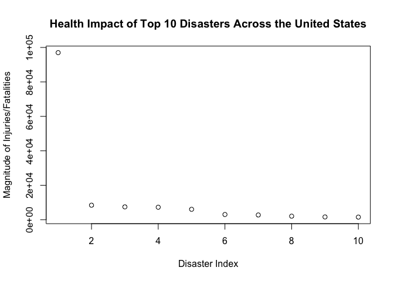

# Top Natural Disasters And Their Impact
Tyler Peterson  
10/12/2016  


## Introduction

  Storms and other severe weather events can cause both public health and economic problems for communities and municipalities. Many severe events can result in fatalities, injuries, and property damage, and preventing such outcomes to the extent possible is a key concern.
  
  This project involves exploring the U.S. National Oceanic and Atmospheric Administration's (NOAA) storm database. This database tracks characteristics of major storms and weather events in the United States, including when and where they occur, as well as estimates of any fatalities, injuries, and property damage.  The goal of this project is to answer the following two questions:
  
  * Across the United States, which types of events (as indicated in the 𝙴𝚅𝚃𝚈𝙿𝙴 variable) are most harmful with respect to population health?
  
  * Across the United States, which types of events have the greatest economic consequences?

## Data Pre-Processing and EDA

  The data for this project were downloaded from the following link: <https://d396qusza40orc.cloudfront.net/repdata%2Fdata%2FStormData.csv.bz2>.
  
  Once the data were downloaded, they were read in and examined (code output is not included here)


```r
  df <- read.csv("repdata%2Fdata%2FStormData.csv.bz2")
  #View(df)
  #str(df)
  #propdmgexpdistinct <- df %>% distinct(PROPDMGEXP)
  #propdmgexpdistinct$PROPDMGEXP
  #distinctEventType <- df %>% distinct(EVTYPE)
  #distinctEventType$EVTYPE
  dfMod <- df[,c(8, 23, 24, 25, 27)]
```

## Data Processing

  Upon examination, the columns that had to do with population health (Fatalities and Injuries) were summed together into a single column labelled **TOTDEST**.  The columns that had to do with economic consequences (PROPDMG and CROPDMG) were also summed together into a single column labelled **TOTDMG**


```r
  dfMod$TOTDEST <- apply(dfMod[,2:3], 1, FUN = sum)
  dfMod$TOTDMG <- apply(dfMod[,4:5], 1, FUN = sum)
```

  Once the data had been aggregated together into the new columns, the values in those columns were summed by event type (EVTYPE) to create totals for each event type.


```r
  totByEvent <- sort(tapply(dfMod$TOTDEST, dfMod$EVTYPE, FUN = sum), decreasing = TRUE)
  totByDmg <- sort(tapply(dfMod$TOTDMG, dfMod$EVTYPE, FUN = sum), decreasing = TRUE)
  cat(sprintf("List totByEvent contains %d total incidents.", length(totByEvent)))
```

```
## List totByEvent contains 985 total incidents.
```

```r
  cat(sprintf("List totByDmg contains %d total incidents.", length(totByDmg)))
```

```
## List totByDmg contains 985 total incidents.
```

## Results

  Since each respective list contains 985 items, it would be counterproductive to display and report on all incidents in the results.  As such, the top 10 results were plotted and displayed for both population health and economic consequences.


```r
  totByEventReduce <- head(as.data.frame(totByEvent), n = 10)
  totByDmgReduce <- head(as.data.frame(totByDmg), n = 10)
  names(totByEventReduce) <- c("POP_HEALTH_MAGNITUDE")
  names(totByDmgReduce) <- c("ECO_DMG_MAGNITUDE")

  plot(totByEventReduce, ylab = "Magnitude of Injuries/Fatalities", xlab = "Disaster Index", 
       main = "Health Impact of Top 10 Disasters Across the United States")
```

<!-- -->

```r
  plot(totByDmgReduce, ylab = "Magnitude of Economical Damages", xlab = "Disaster Index", 
       main = "Economic Impact From Top 10 US Disasters")
```

<!-- -->

```r
  print(totByEventReduce)
```

```
##                   POP_HEALTH_MAGNITUDE
## TORNADO                          96979
## EXCESSIVE HEAT                    8428
## TSTM WIND                         7461
## FLOOD                             7259
## LIGHTNING                         6046
## HEAT                              3037
## FLASH FLOOD                       2755
## ICE STORM                         2064
## THUNDERSTORM WIND                 1621
## WINTER STORM                      1527
```

```r
  print(totByDmgReduce)
```

```
##                    ECO_DMG_MAGNITUDE
## TORNADO                    3312276.7
## FLASH FLOOD                1599325.1
## TSTM WIND                  1445168.2
## HAIL                       1268289.7
## FLOOD                      1067976.4
## THUNDERSTORM WIND           943635.6
## LIGHTNING                   606932.4
## THUNDERSTORM WINDS          464978.1
## HIGH WIND                   342014.8
## WINTER STORM                134699.6
```

  It is evident in both the population health and economic consequences that a single disaster causes significantly more damage than all others.  Indeed, by examining both lists of the top 10 disasters, we can see that tornadoes single handedly cause more physical and economic destruction than any other disaster.
